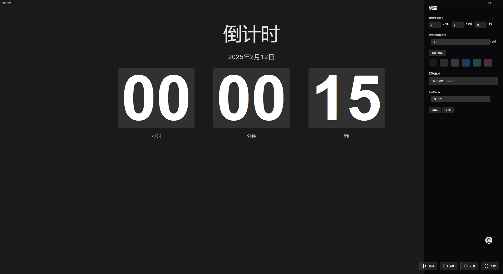

# 面试倒计时
基于Electron的全屏倒计时应用，支持自定义背景、时间设置、提醒功能，设计风格参考Fliqlo。



## 功能特性

- 🕒 全屏倒计时显示（支持小时/分钟/秒）
- 🎨 自定义背景（纯色/图片）
- ⏰ 提前提醒和时间到提醒（支持声音+视觉提示）
- 📌 窗口拖拽定位记忆功能
- 🖥️ 全屏/窗口模式切换
- ⚙️ 本地设置持久化存储

## 技术栈

- Electron 31 + TypeScript 5
- React 18 + Vite 5
- Electron Builder 24

## 快速开始

### 安装依赖

## Project Setup

### Install

```bash
$ npm install
```

### Development

```bash
$ npm run dev
```

### Build

```bash
# For windows
$ npm run build:win

# For macOS
$ npm run build:mac

# For Linux
$ npm run build:linux
```
